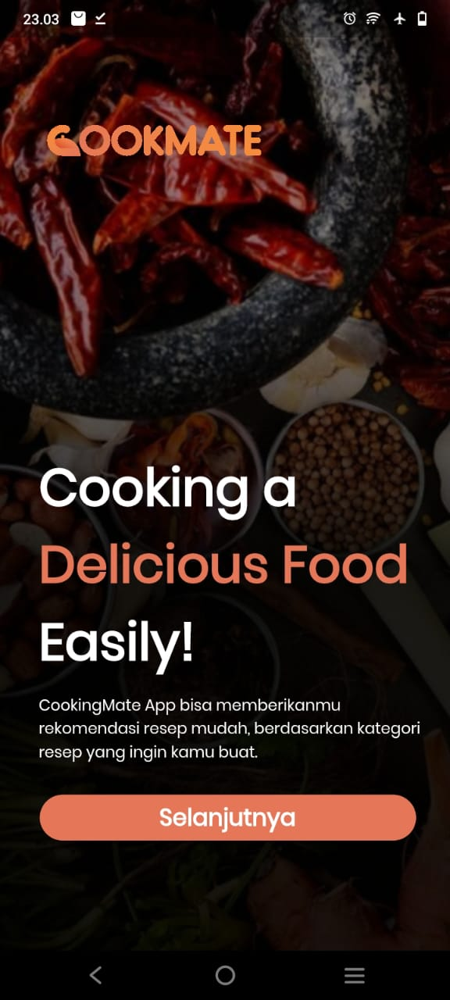
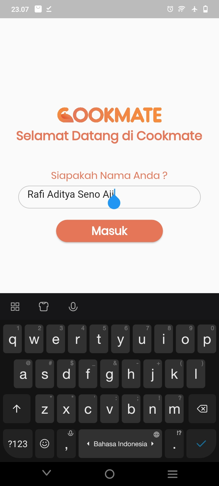
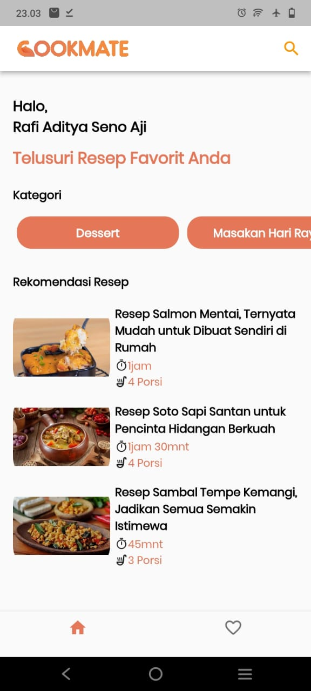
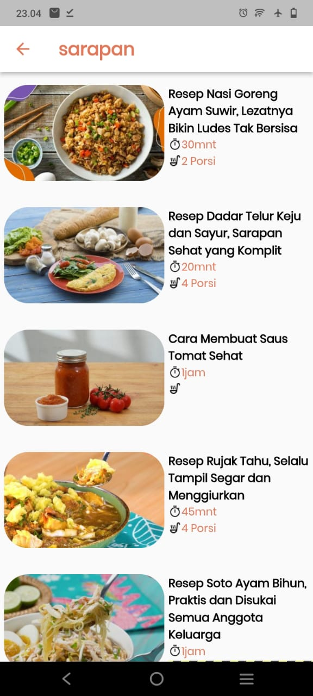
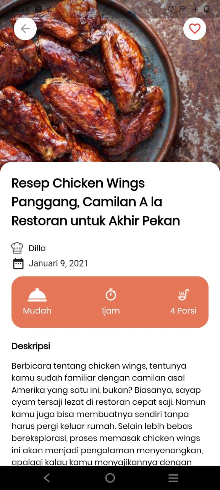

# cookmate

Cookmate merupakan aplikasi mobile yang menyediakan informasi resep makanan dan minuman

## 💡 Background
Di era modern ini, banyak media yang bisa dijadikan sarana mengembangkan kemampuan memasak, yaitu mengeksplorasi resep, seperti buku resep, kursus atau situs-situs yang menyediakan berbagai macam resep. Sayangnya, media tersebut kurang memenuhi kepuasan pengguna saat mengeksplorasi resep - resep yang ada, dan kurang praktis jika harus mencari buku resep atau membuka situs-situs resep yang ada. Oleh karena itu Tim CSD-091 memilih proyek Cookmate sebagai aplikasi android yang menyediakan resep - resep makanan. Dengan aplikasi ini, pengguna mampu mencari resep sesuai dengan keinginan menggunakan fitur search atau kategori resep yang ada, harapannya aplikasi ini mampu membantu pengguna mempermudah melakukan pencarian resep-resep masakan. 

## ♻️ Project Goals
aplikasi informasi resep makanan dan minuman ini dibuat dengan tujuan membuat senang para pengguna, kami ingin pengguna tidak merasa kesulitan dalam menggunakan aplikasi informasi resep makanan dan minuman

## 🤯 Challenges we faced
Ini merupakan pertama kalinya kami belajar pemrograman mobile. Kami mencoba membuat aplikasi informasi resep dengan berkelompok secara daring, tidak hanya dari segi teknikal, namun dari segi komunikasi dan manajemen proyek juga cukup jadi tantangan bagi kami.

## 🧐 How we built our project
Cookmate adalah aplikasi mobile yang menggunakan Flutter sebagai framework. 

## 🧑‍🎓 What we learned
Bagi kami, ini adalah kolaborasi pertama yang kami kerjakan, dan kami benar-benar bersemangat bahwa semua itu harus dilakukan hanya dalam 5 minggu. Memiliki waktu yang terbatas membuat kami bekerja lebih cepat dengan strategi yang lebih efisien.‎

‎Kami memanfaatkan GitHub Issues sebagai platform manajemen proyek kami. Kami mulai dengan mencantumkan beberapa fitur yang ingin kami bangun dan kembangkan secara bertahap saat kami bekerja paralel dengan aplikasi front-end dan back-end.‎

## Screen Capture

#### Search Page:

#### Login Page:

#### Home Page:

#### Search Page:

#### Search Page:

## Contributors ✨

Thanks goes to these wonderful people ([emoji key](https://allcontributors.org/docs/en/emoji-key)):

<!-- ALL-CONTRIBUTORS-LIST:START - Do not remove or modify this section -->
<!-- prettier-ignore-start -->
<!-- markdownlint-disable -->
<table>
  <tr>
    <td align="center"><a href="https://github.com/bagasrmdhn"> <b>Moch Bagas Ramadhani</b></a> <a href="https://github.com/rafiaditya1/cookmate/commits?author=bagasrmdhn" title="Code">💻</a> <a href="#infra-bagasrmdhn" title="Infrastructure (API, Design, etc)">🎨</a></td>
 <td align="center"><a href="https://github.com/rafiaditya1"> <b>Rafi Aditya Seno Aji </b></a> <a href="https://github.com/rafiaditya1/cookmate/commits?author=rafiaditya1" title="Code">💻</a> <a href="#infra-rafiaditya1" title="Infrastructure (UI, Design, Backend etc)">🎨</a></td>
   
  </tr>
</table>

<!-- markdownlint-restore -->
<!-- prettier-ignore-end -->

<!-- ALL-CONTRIBUTORS-LIST:END -->

